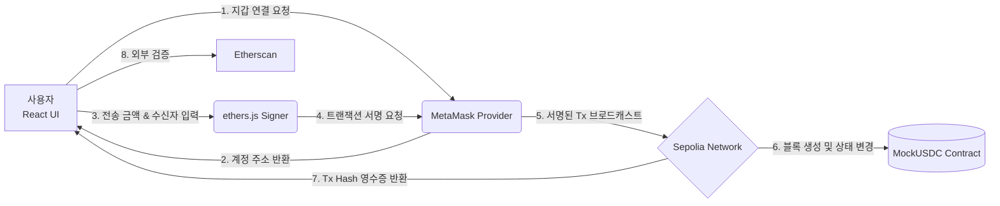

# 🪙 Web3 USDC Payment System MVP

<div align="center">
  
  
  
  
  
</div>

<br />

**Web3 USDC Payment System**은 블록체인 상의 스마트 컨트랙트와 프론트엔드를 연동하여, 암호화폐(USDC)를 통한 실제 가치 전송 파이프라인을 구현한 분산 애플리케이션 포트폴리오입니다.

단순한 지갑 연동을 넘어, 온체인 데이터의 상태 변경을 유발하는 트랜잭션 서명 과정과 그 무결성을 제3의 블록 익스플로러(Etherscan)를 통해 교차 검증하는 E2E 결제 흐름을 구축하는 데 집중했습니다.

---

## 🔗 Live Demo
- **Service URL**: https://usdc-payment-system.vercel.app/

---

## 🎯 프로젝트 목표 및 달성

- **Web3 통신 규약 이해**: 기존 REST API(HTTP) 방식이 아닌, JSON-RPC 기반의 블록체인 노드 통신과 프로바이더/서명자 객체의 역할 분리 구현
- **상태 변경 무결성 증명**: 데이터베이스 대신 스마트 컨트랙트를 백엔드로 활용하여, 결제 금액과 수신자가 위변조 없이 블록에 기록되는 과정을 증명
- **사용자 경험(UX) 최적화**: 트랜잭션 대기 시간 동안의 비동기 처리 및 결제 완료 후 트랜잭션 해시 동적 렌더링

---

## 🛠️ 기술 스택 (Tech Stack) 및 도입 배경

| Category | Technology | Description & Rationale |
| :--- | :--- | :--- |
| **Frontend** | React, Vite | 컴포넌트 단위의 UI 구성 및 상태(State) 기반의 즉각적인 화면 렌더링을 위해 도입 |
| | ethers.js | 프론트엔드와 이더리움 노드 간의 브릿지 역할. Web3.js 대비 가볍고 TypeScript 지원이 우수하여 채택 |
| **Smart Contract** | Solidity | 이더리움 가상 머신(EVM) 환경에서 작동하는 ERC-20 표준 인터페이스 구현 언어 |
| | Remix IDE | 로컬 환경 구축 없이 클라우드 상에서 컨트랙트 컴파일 및 테스트넷 배포를 즉각 수행하기 위해 사용 |
| **Infrastructure** | Sepolia Testnet | 실제 자금 소모 없이 상용망(Mainnet)과 동일한 환경에서 트랜잭션을 테스트하기 위한 PoS 테스트넷 |
| | MetaMask | 사용자의 개인키(Private Key)를 브라우저 내에 안전하게 보관하고 트랜잭션 서명을 위임받는 지갑 계층 |
| **Deployment** | Vercel | GitHub 리포지토리 연동을 통한 CI/CD 파이프라인 및 HTTPS 기반 퍼블릭 접속 환경 제공 |

---

## 🏗️ 시스템 아키텍처

결제 요청부터 블록 확정까지의 트랜잭션 라이프사이클입니다.



---

## 💡 문제 해결 (Troubleshooting)

### 1️⃣ 트랜잭션 검증의 불투명성 해결

- **문제 상황**: 초기 구현 시 `transfer` 함수 호출 후 브라우저의 `alert` 창으로만 결제 완료를 알렸습니다. 그러나 이는 프론트엔드 단의 이벤트일 뿐, 실제 블록체인 네트워크 상에서 거래가 성공적으로 블록에 포함되었는지 물리적으로 증명할 수 없는 설계적 결함이 있었습니다.
- **해결 방안**:
  - 비동기 처리(`await tx.wait()`)를 도입하여 트랜잭션이 블록에 완전히 확정될 때까지 프론트엔드의 상태 변경을 대기시켰습니다.
  - 트랜잭션 객체에서 고유 해시값(`tx.hash`)을 추출하고, React의 상태 변수에 저장하여 결제 완료 UI에 동적으로 렌더링했습니다.
  - 이 해시값을 Etherscan 블록 익스플로러 URL과 결합하여, 사용자와 평가자가 거래의 온체인 무결성을 제3자 기관을 통해 직접 확인할 수 있는 영수증 시스템을 구축했습니다.

### 2️⃣ Web3 Provider와 Signer의 권한 분리 설계

- **문제 상황**: 단순 잔액 조회(Read) 기능과 토큰 전송(Write) 기능을 구현할 때, 이더리움 노드와 통신하는 주체 객체에 대한 이해 부족으로 런타임 에러가 발생했습니다.
- **해결 방안**: Ethers.js의 아키텍처를 분석하여 두 권한 계층을 명확히 분리하여 컨트랙트 인스턴스를 생성했습니다.
  - **Read-Only (잔액 조회)**: `new ethers.BrowserProvider()`만을 인자로 넘겨 네트워크에서 상태만 읽어오도록 설계.
  - **State-Changing (결제 전송)**: Provider에서 `getSigner()` 메서드를 호출하여 사용자의 개인키로 트랜잭션에 서명할 수 있는 권한을 가진 객체를 컨트랙트에 연결함으로써 트랜잭션 거부 문제를 해결했습니다.

---

## 📂 폴더 구조 (Project Structure)

```text
usdc-payment-system/
├── MockUSDC.sol             # ERC-20 스마트 컨트랙트 원본 코드 (Remix 배포용)
├── frontend/                # React 웹 애플리케이션 루트
│   ├── src/
│   │   ├── constants.js     # 배포된 컨트랙트 주소 및 ABI 정의
│   │   ├── App.jsx          # 지갑 연결, 잔액 조회, 결제 트랜잭션 메인 로직
│   │   └── main.jsx         # React Entry Point
│   ├── package.json         # 프론트엔드 의존성 (ethers.js 등) 관리
│   └── vite.config.js       # Vite 번들러 설정
```

<div align="center">
  <p>Developed by Byeonggwan Kang</p>
</div>
